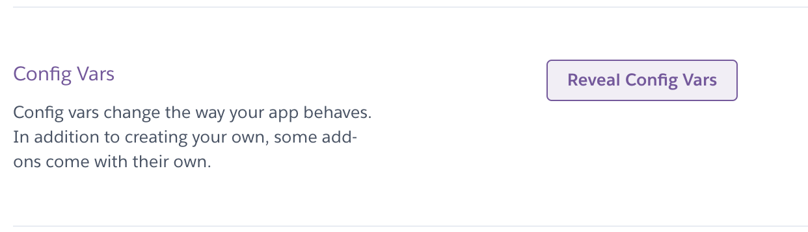
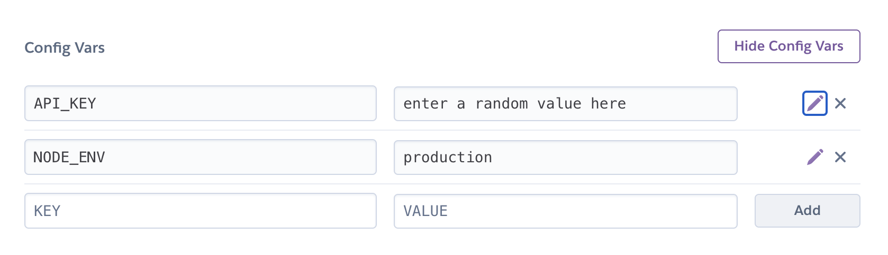

# Noroff Assignment API

The Noroff Assignment API will be used to complete each of the assignments using JavaScript Frameworks.

## Prerequisites
In order to use the API you will require the following:
1. Install [Git](https://git-scm.com/) 
2. Install [NodeJS LTS](https://nodejs.org/en/) with npm **(It must be the LTS version.)**
3. Create a [Heroku](https://www.heroku.com/) account (free)

## Instructions
Follow the below instructions to get your API setup and ready for use.

1. Clone the repository to your computer
2. Run `npm install` in the root of the cloned repository
3. Ensure you have the [Heroku CLI Installed](https://devcenter.heroku.com/articles/heroku-cli#download-and-install) by running `heroku --version` in your terminal app
4. Run the following commands (In the project root directory):
   * Remove the cloned repository: `git remote remove origin`
   * Create a new Heroku App: `heroku create <choose-a-name-for-your-app>`
      * e.g. `heroku create noroff-assignment-api`
      * **Please note:** The name chosen must be unique on the `.herokuapp.com` domain
   * Ensure all files are added to git `git add .`
   * Commit all the files: `git commit -m "FEAT: Heroku"`
   * Push the files to your heroku app: `git push heroku master`
5. The app will be automatically deployed and started.
6. Check the terminal for your API's Url.

## API Key and Authorization Header

Lastly, on your [Heroku Dashboard](https://dashboard.heroku.com), open your API application, find the settings tab and look for the Config Vars section

#### Locate the "Reveal Config Vars" button and click it



#### **Enter TWO config vars:**
```bash
NODE_ENV : production
API_KEY : any randomly generated string (64 characters)
```
See the screenshot below.



## Accessing Endpoints

Each API endpoint contains both open and protected endpoints. All `GET` endpoints are open. Any other method `POST`, `PUT`, `PATCH` and `DELETE` is protected with the `X-API-KEY` header.

### Trivia Game API
[Trivia API Docs](./docs/trivia.md)

### Lost in Translation API
[Lost In Translation](./docs/lost-in-translation.md)

### Pokémon Trainer API
[Pokémon Trainer](./docs/pokemon-trainer.md)

# Special thanks to Typicode for json-server

[Github: json-server](https://github.com/typicode/json-server)